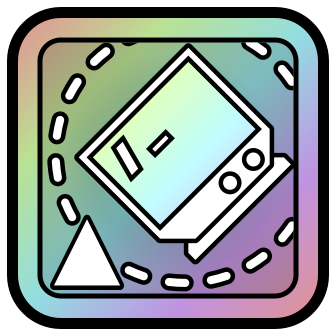

# Geometron



This mod implements a work-in-progress Lua scripting engine for the Geometry Dash editor. For more information, see `about.md`.

## Build instructions
For more info, see [the Geode documentation](https://docs.geode-sdk.org/getting-started/create-mod#build)
```sh
# Assuming you have the Geode CLI set up already
geode build
```

# Resources
* [Geode SDK Documentation](https://docs.geode-sdk.org/)
* [Geode SDK Source Code](https://github.com/geode-sdk/geode/)
* [Geode CLI](https://github.com/geode-sdk/cli)
* [Bindings](https://github.com/geode-sdk/bindings/)
* [Dev Tools](https://github.com/geode-sdk/DevTools)
